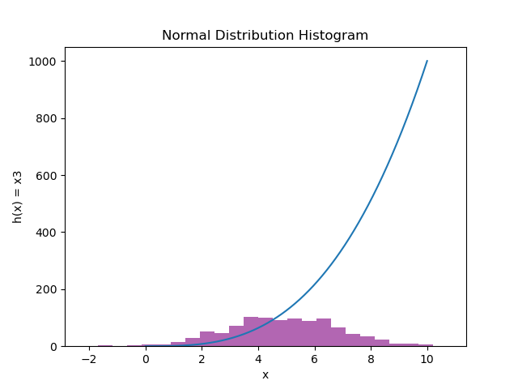

# pands-weekly-tasks

## This repository is for the Programming and Scripting module in the Data Analytics Higher Diploma course. Worth 50% of the module, there were eight weekly tasks given to complete by Monday the 28th of April 2025 using Python (through VSCode in my case). 

----------
### Week One: Hello World

#### This simple task was the first one given in the module, a common introduction phrase used when teaching coding. The intended output for this module is a simple "Hello, World" phrase printed in the terminal.

----------
### Week Two: Bank

----------
### Week Eight
Output: 

----------

### References
Slack Overflow on Hello World: https://stackoverflow.com/questions/602237/where-does-hello-world-come-from

# ----------End---------- #